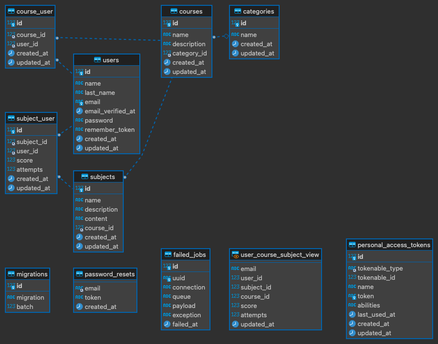
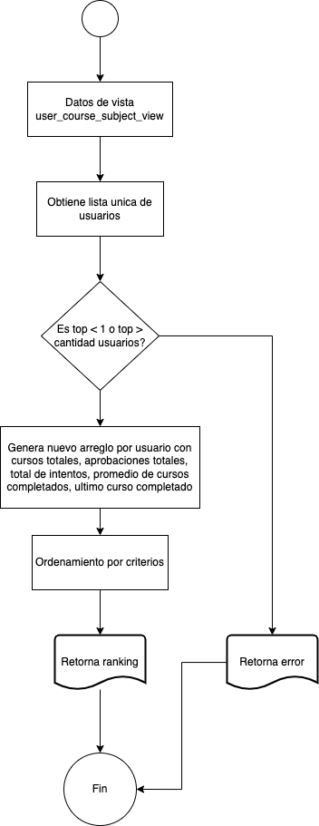
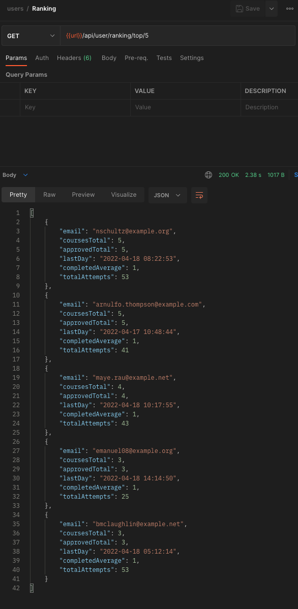

# CURSALAB TEST


## Correr las migraciones y los seeders

```
docker-compose exec php php /var/www/html/artisan migrate:fresh --seed
```

## URL Local
```
http://localhost:8888
```

## Rutas disponibles
 - /api/user
    - GET / - Consulta a todos los usuarios
    - GET /{id}/course/{course_id} - Agrega un curso a un usuario
    - GET /{id}/course/{course_id}/subject/{subject_id}/score/{score} - Agrega un puntaje a un tema de un curso del usuario
    - GET /ranking/top/{top} - Obtiene el top de productos
 - /api/category - CRUD a la tabla categories
 - /api/subject - CRUD a la tabla subject
 - /api/course - CRUD a la tabla course


 ## Modelo entidad relación 
 

## Diagrama de algoritmo de consulta de ranking


 ## Ejemplo de resultado de top 5
 